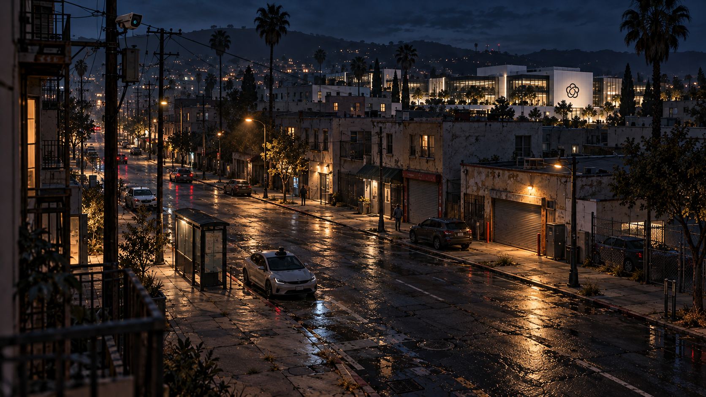
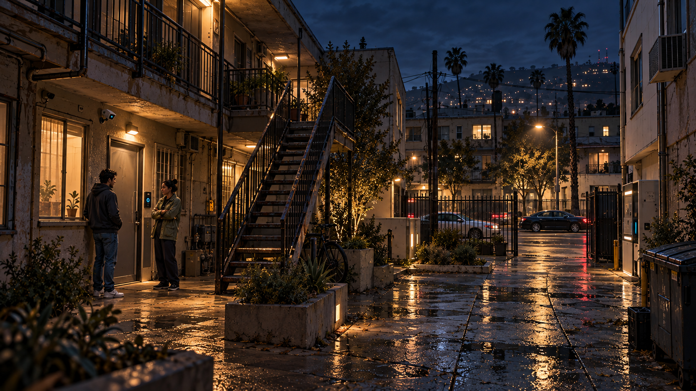
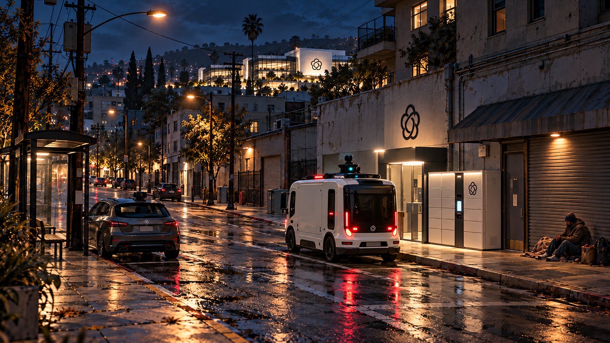
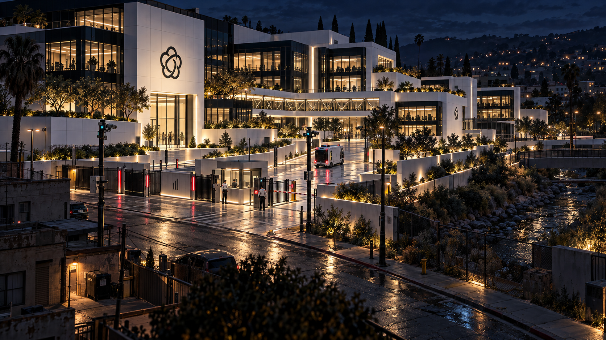
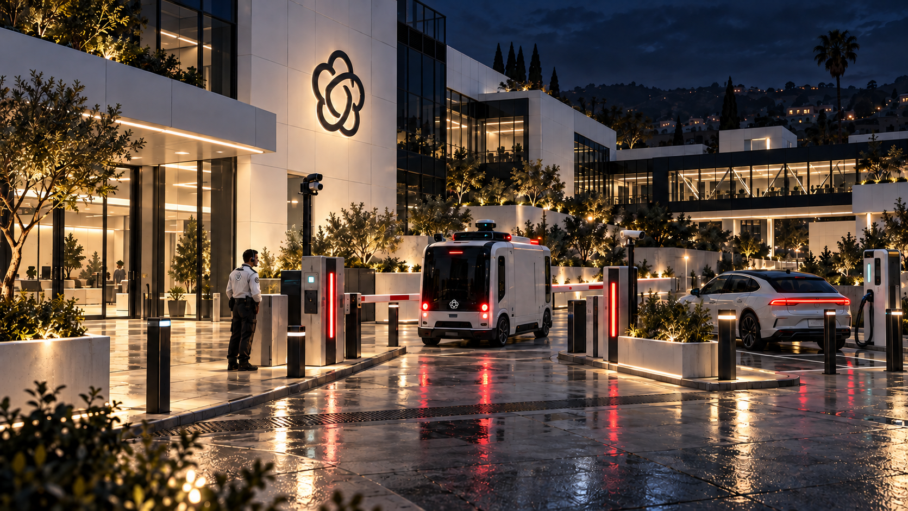
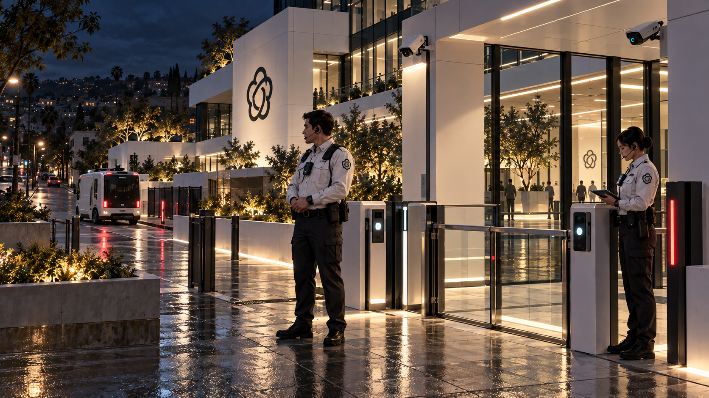

# City and OpenBrain campus study

Six coordinated environment concepts for Bryson's realistic near-future game, generated
October 10, 2026 with the built-in image generation tool. All six are complete and visually
checked by the agent, preserving their native RGB PNG outputs: five at 1672 × 941 and the
vehicle forecourt at 1671 × 941. None was resized or resampled.

The [original supplied image](reference-original.png) anchors the overall mood. The
[preferred creekside revision](../valley-composition-study-2026-10-08/04-creekside-campus-v2.png)
anchors California geography, the campus architecture and emblem. Bryson selected the first
commercial-street render's lighting: failed and aged public fixtures, with sufficient exposure
to inspect architecture, routes, clothing and technology. The darker attempted edit is excluded.

These are exploratory concepts. Generation and push were approved; final asset design and
reference selection remain with Bryson. They have not been integrated into or tested in the game.

| No. | View | Details to inspect |
|---|---|---|
| 1 | [City commercial street](01-city-commercial-street.png) | Varied California buildings, neglected road surfaces and retrofitted vehicle/camera hardware. |
| 2 | [City residential courtyard](02-city-residential-courtyard.png) | Repairs, utilities, entry readers and realistic contemporary civilian clothing. |
| 3 | [City service and transit edge](03-city-service-and-transit-edge.png) | Autonomous delivery alongside failing public infrastructure and sparse poverty. |
| 4 | [Campus exterior and approach](04-campus-exterior-and-approach.png) | Stepped white/black campus, controlled paths and comprehensive observation. |
| 5 | [Campus autonomous vehicle forecourt](05-campus-autonomous-vehicle-forecourt.png) | Delivery van, passenger vehicle, charging, scanners and vehicle access equipment. |
| 6 | [Campus headset security threshold](06-campus-headset-security-threshold.png) | Practical guard clothing, headsets, body cameras and human-scale access controls. |

The visual review checked night exposure and material readability, California architecture,
campus/emblem continuity, vehicle and access-device construction, and realistic guard headsets
and clothing. Incidental vehicle branding in shots 3 and 5 was cleaned up while preserving their
lighting and composition.

The [approved prompt review](prompt-review.md) records the shared direction and shot briefs.
[generation-record.json](generation-record.json) records each exact prompt, ordered reference
images and the selected output. The commercial-street and campus-approach prompts retain the
wording actually used before Bryson clarified the lighting; the remaining prompts incorporate
his chosen exposure. Cleanup
prompts and their local generation input/output paths are also recorded. Those intermediate
images remain in the generator's local output folder; the six selected deliverables are here.

## Images

### 1. City commercial street

### 2. City residential courtyard

### 3. City service and transit edge

### 4. Campus exterior and approach

### 5. Campus autonomous vehicle forecourt

### 6. Campus headset security threshold

