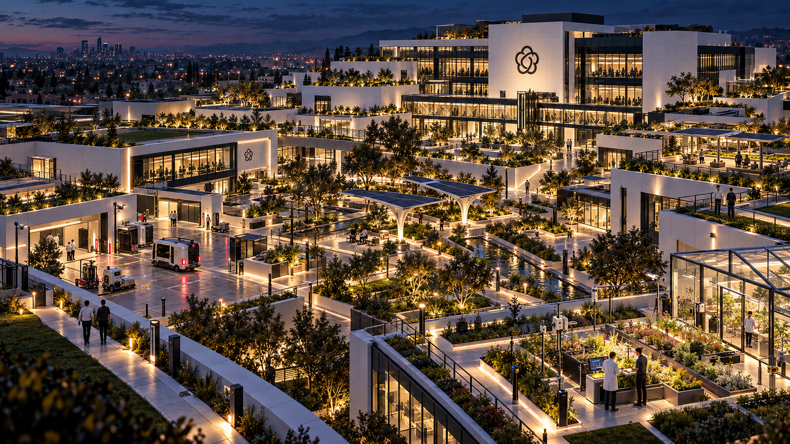
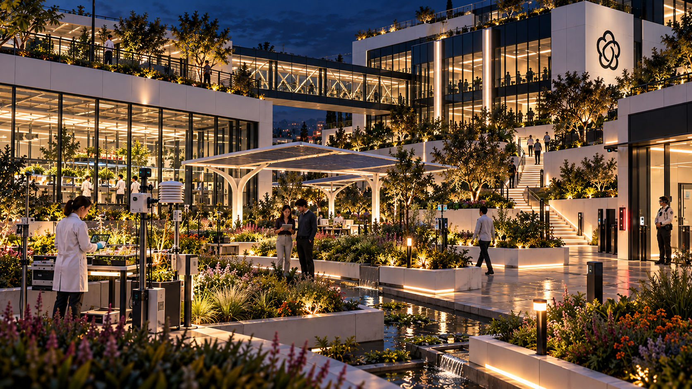
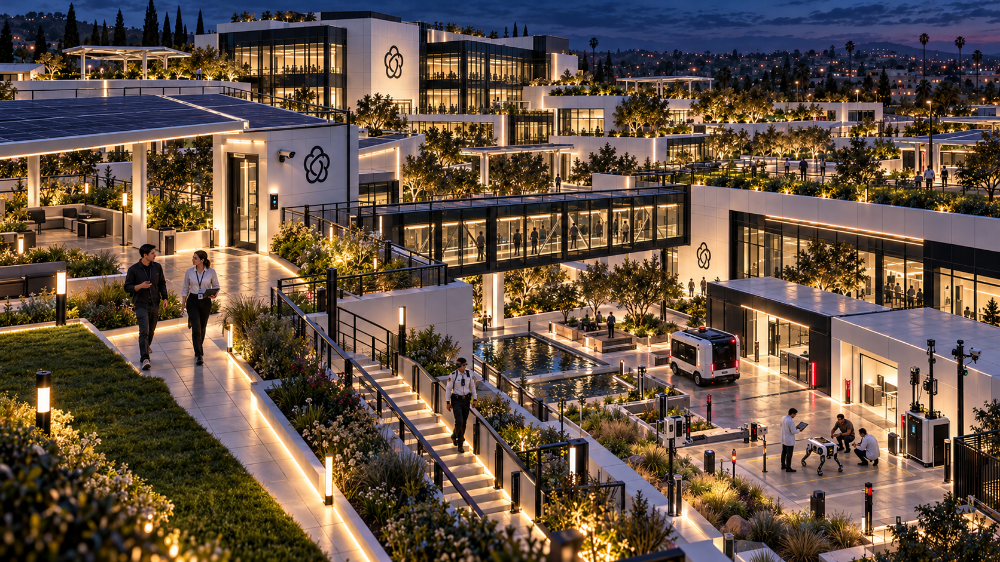

# OpenBrain rear research park

Three realistic environment concepts generated October 10, 2026 with the built-in image
generation tool. Native PNGs are saved alongside the exact prompts in this folder.

## Bryson's direction

Behind the massive principal building is a large connected research complex: courtyards,
different-sized buildings, substantial outdoor space and accessible rooftops. It is a modern
solarpunk technological paradise, with avant-garde gardens and different research sections
led by different teams. Keep the exterior's white/black architecture and sparse red accents,
adding grass, plants and green roofs.

This cohesion with nature is artificial and maintained at the expense of nature and society
outside. The scientists and employees are ordinary people who benefit from the institution;
some may hope to change it from within. The interior should be beautiful enough that a world
made this way would be desirable. Exploration takes place throughout this connected park.

## Views and rendered choices

| No. | View | Reference value |
|---|---|---|
| 1 | [Rear campus overview](01-rear-campus-overview.png) | Large principal building, varied pavilions, distinct courtyard sections and connected roof/ground circulation. |
| 2 | [Experimental garden courtyard](02-experimental-garden-courtyard.png) | Instrumented planting, greenhouse work, ordinary employees, water channels, access devices and upper terraces. |
| 3 | [Green roof and research connections](03-green-roof-research-connections.png) | Roof lawn, solar canopy, roof door, stairs, glazed bridge and an outdoor autonomy/robotics testing court. |

Early evening light preserves the exterior's cool sky and warm architectural illumination,
while keeping greenery, paths and devices readable. The section choices—plant/environment
experiments, autonomy testing and collaboration gardens—are illustrative interpretations.
Building footprints, courtyard layouts, team assignments and exact routes remain concept
proposals rather than adopted level design.

## Continuity and review

The [existing exterior](../city-and-campus-study-2026-10-10/04-campus-exterior-and-approach.png)
anchors the architecture, materials and friendly emblem. The
[AR-equipped security view](../city-and-campus-study-2026-10-10/06-campus-headset-security-threshold-v2-ar.png)
anchors people and devices, including the guards' sports glasses, visible cable and belt compute
puck. The completed overview was supplied as a third reference for both closer views.

Agent visual review checked the architectural family, maintained green roof/planting language,
readable roof access and connections, ordinary employees, and purposeful experimental/sensor
hardware. No image text or game interface was requested. The native outputs were checked as
RGB PNGs and preserved without resampling. These are conceptual spatial studies, not a measured
map or a gameplay visibility/pathfinding test. Final visual selection remains with Bryson.

[generation-record.json](generation-record.json) contains every exact prompt, ordered reference
paths, project reference links, selected output paths, native dimensions and hashes. The source
exterior images are retained in their original study folder.

## Images

### 1. Rear campus overview

### 2. Experimental garden courtyard

### 3. Green roof and research connections

